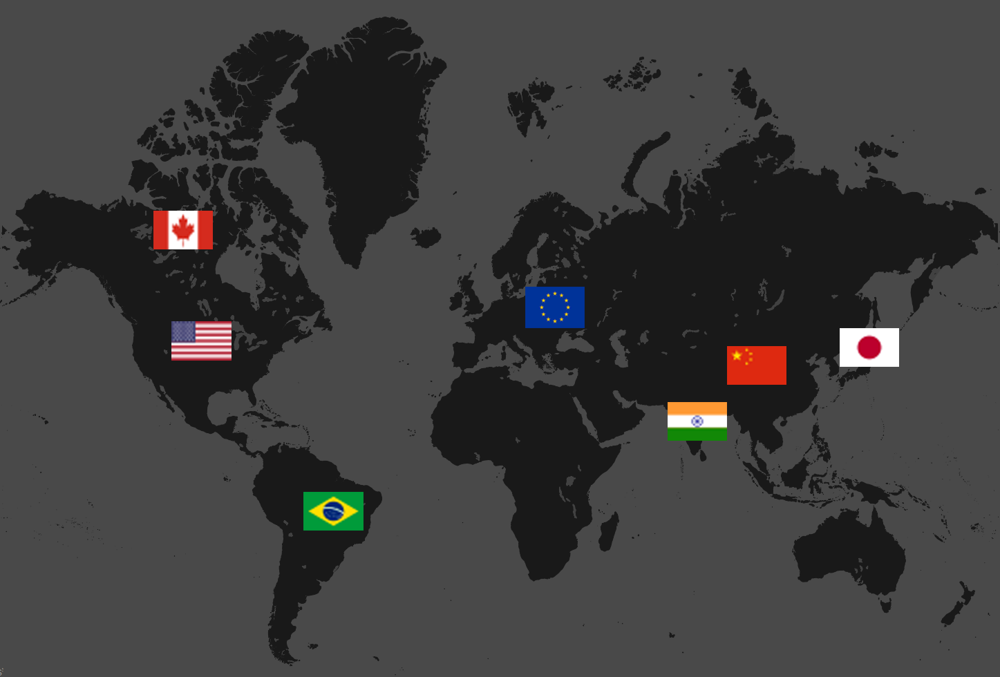

# game-theoretic-agent-simulation

Won the Grand Prize at Yale-NUS hack4climate

Built a multi-agent simulation to model the game-theoretic behaviour of countries' climate policy

[Watch the video](https://www.youtube.com/watch?v=DVdcaNT0RZ8&feature=youtu.be)
